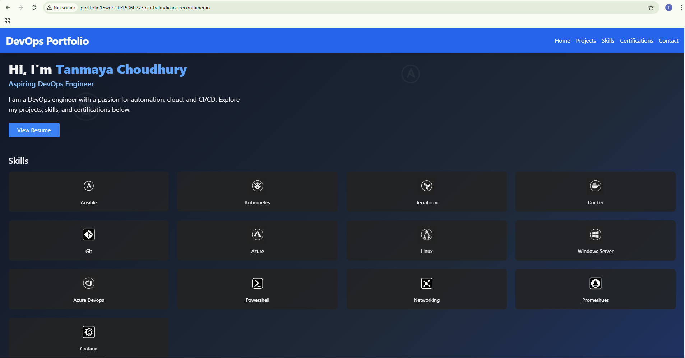

# Azure DevOps CI/CD Pipeline with Docker & Nginx

This repository demonstrates a modern DevOps workflow for building, containerizing, and deploying a static site using Azure Pipelines, Docker, and Azure Container Instances (ACI). The focus is on the automation, containerization, and cloud deployment process, not the website content itself.

---

## CI/CD Workflow Overview

---

## Final Hosted Site Example

---

## Key Components
- **Azure Pipelines**: Automates build, containerization, and deployment steps.
- **Docker**: Multi-stage build for efficient, production-ready images.
- **Nginx**: Serves static content in the final container.
- **Azure Container Registry (ACR)**: Stores built Docker images securely.
- **Azure Container Instances (ACI)**: Runs the container in the cloud.

---

## CI/CD Pipeline Overview

### 1. Build Stage: Secure Authentication
- Authenticate with ACR inside your CI/CD pipeline
- Avoid hardcoding credentials
- Enables seamless docker push and docker pull operations in later pipeline steps

### 2. Push Stage
- Authenticates to Azure Container Registry (ACR) using a secure service connection.
- Pushes the built Docker image to ACR, tagged with the build ID.

### 3. Deploy Stage
- Uses Azure CLI to deploy the image from ACR to Azure Container Instances (ACI).
- Configures CPU, memory, ports, and DNS label for the container.

---

## Dockerfile Highlights
- **Stage 1 (installer):**
  - Uses Node.js to install dependencies and build static assets.
- **Stage 2 (deployer):**
  - Uses Nginx to serve the built static files.
  - Only the final, minimal image is deployed.

---

## Azure Pipeline YAML Highlights
- **Trigger:** Runs on every push to `main`.
- **Docker@2 Task:** Builds and pushes the Docker image to ACR.
- **AzureCLI@2 Task:**
  - Logs in to ACR.
  - Deploys the container to ACI with a unique DNS label per build.

---

## How to Use This Setup
1. **Fork or clone this repository.**
2. **Connect your Azure DevOps project to your Azure subscription and ACR.**
3. **Update variables in `azure-pipelines.yml` for your environment.**
4. **Push to `main` to trigger the pipeline.**
5. **Access the deployed container via the generated DNS label.**

---

## Why This Approach?
- **Separation of concerns:** Build and runtime environments are isolated.
- **Security:** Only production assets are shipped; secrets are not in the image.
- **Cloud-native:** Uses Azure-native services for registry and deployment.
- **Automation:** End-to-end CI/CD with minimal manual steps.

---

## References
- [Azure Pipelines](https://docs.microsoft.com/azure/devops/pipelines/)
- [Docker Multi-Stage Builds](https://docs.docker.com/develop/develop-images/multistage-build/)
- [Azure Container Registry](https://docs.microsoft.com/azure/container-registry/)
- [Azure Container Instances](https://docs.microsoft.com/azure/container-instances/)
